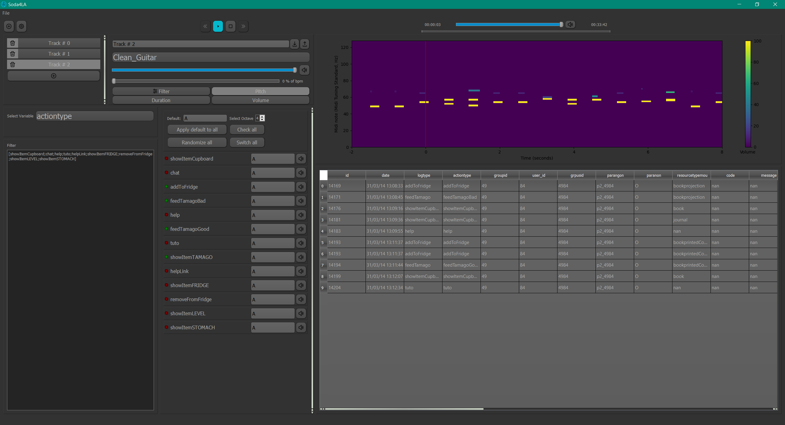

# Soda
 #### Sonification of Data for Learning Analytics

Open source application to sonify learning analytics data based on users preference.
Designed to be used as a data exploration tool.

### Sonification
“A systematic and reproducible transformation technique that can be used with different input data to produce sound that reflects objective properties or relations in the data.”

We think that new radical ideas are needed for learning analytics and we want to drastically reverse the traditional approach that is actually based on data visualization. We want to explore the potential of data sonification for the analysis of complex datasets in the field of educational sciences. Thus, Soda aims at evaluating the feasibility and the potential value of sonification for learning analytics.

### Install
Check release page for the latest version.
github.com/AndreCI/sodaMidi/releases

### About
André Cibils\
UNIGE - Technologies de Formation et d'Apprentissage\
Sous la supervision du Pr. Eric Sanchez