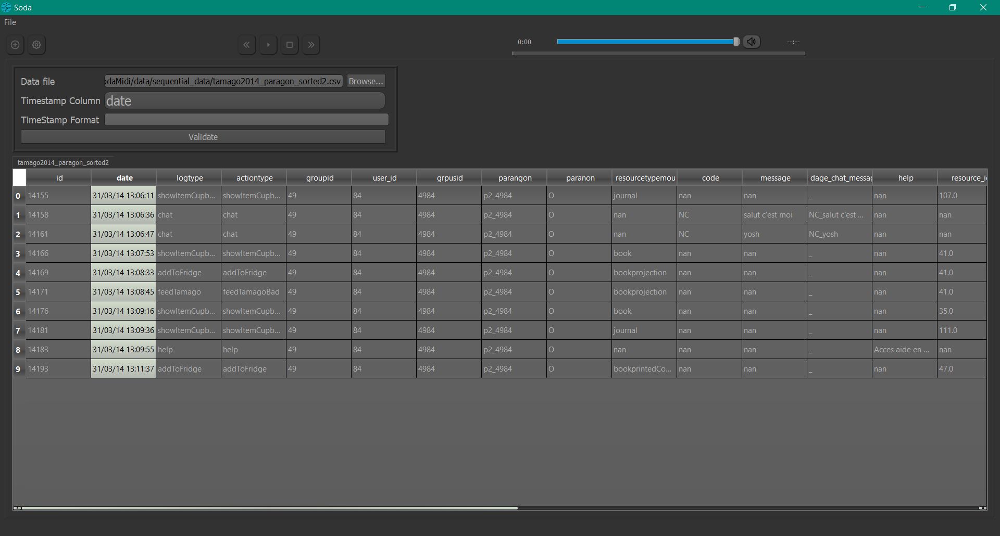
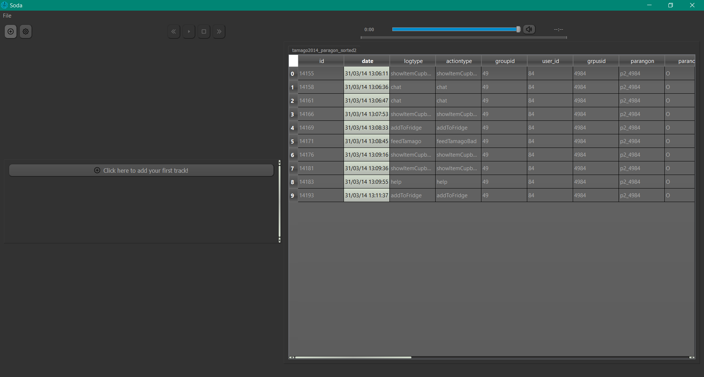
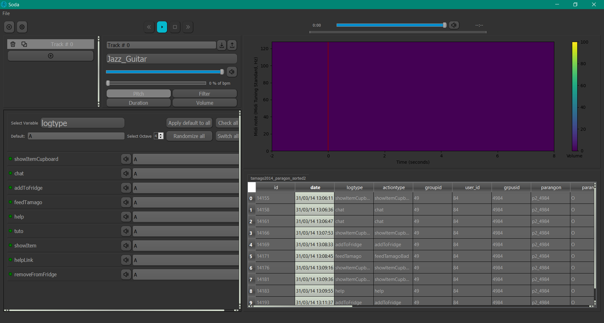
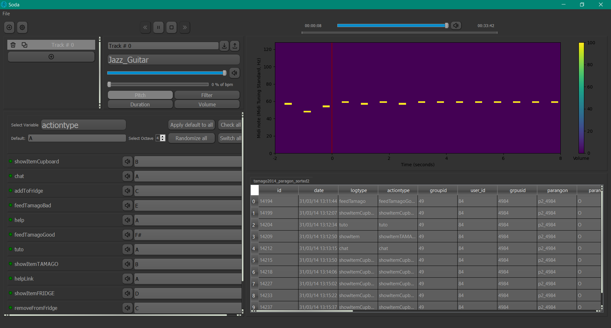
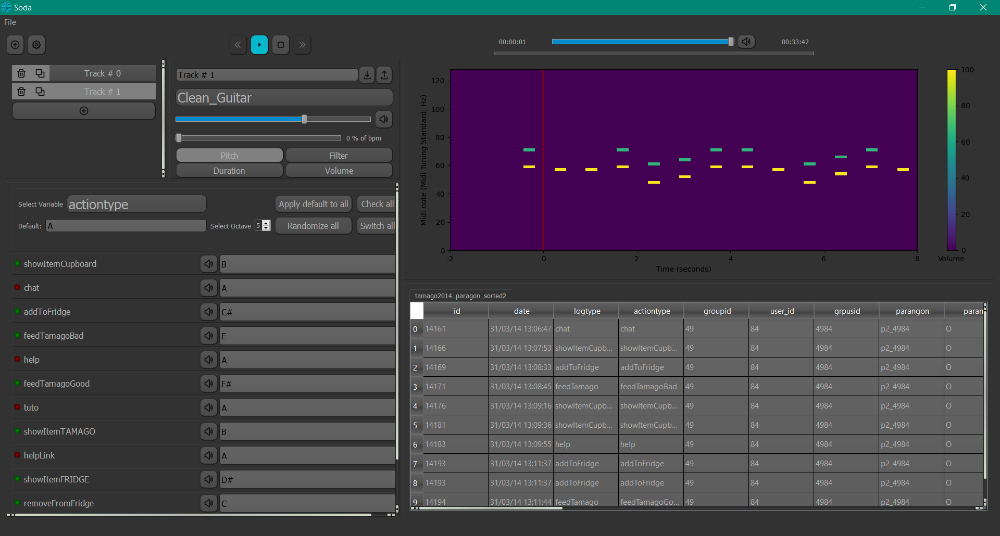
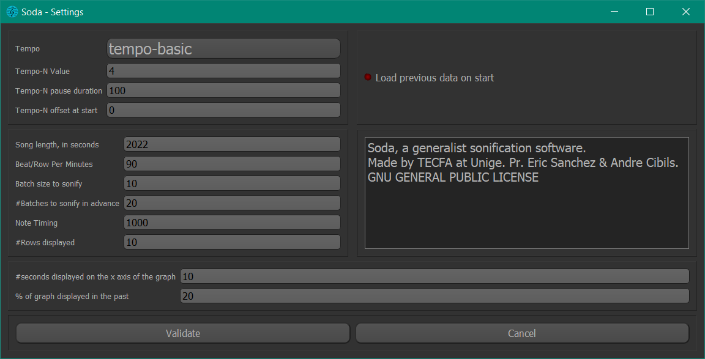
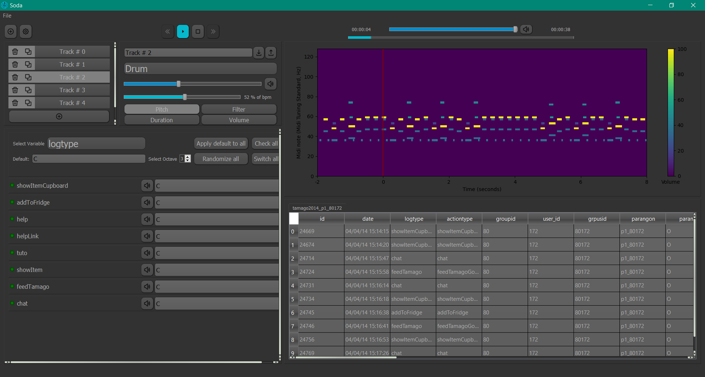
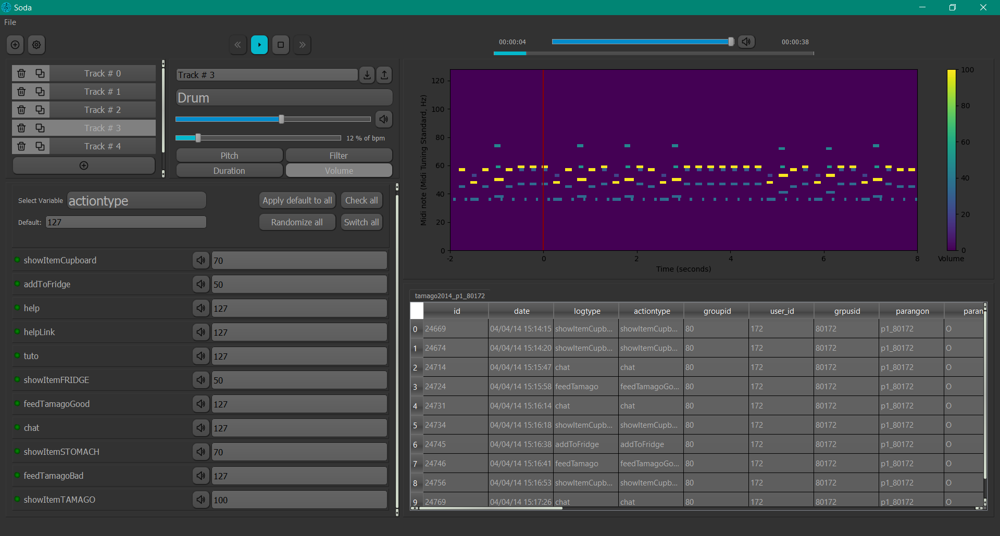
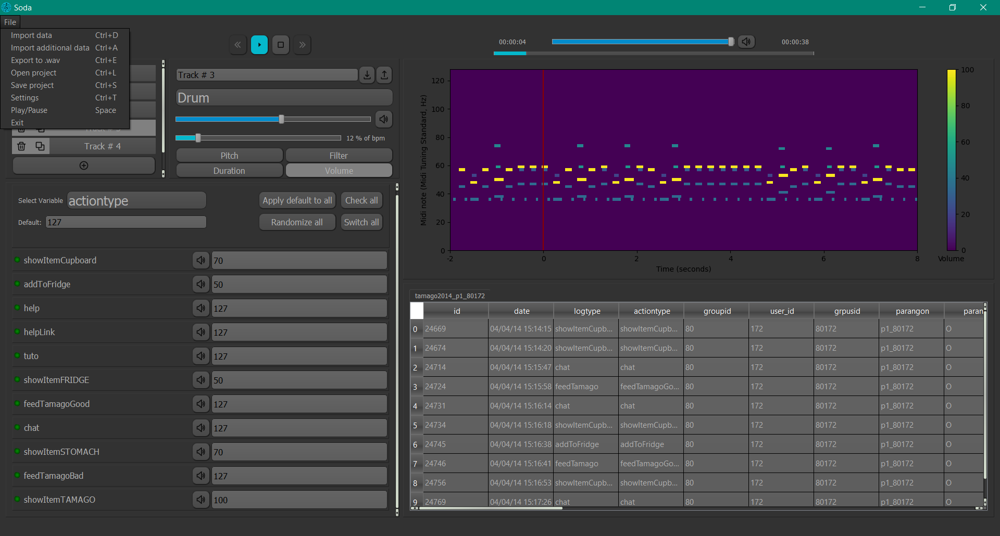

# Soda
 #### Sonification of Data

Open source application to sonify learning analytics data based on users preference.
Designed to be used as a data exploration tool.

### Sonification
“A systematic and reproducible transformation technique that can be used with different input data to produce sound that reflects objective properties or relations in the data.”

We think that new radical ideas are needed for learning analytics and we want to drastically reverse the traditional approach that is actually based on data visualization. We want to explore the potential of data sonification for the analysis of complex datasets in the field of educational sciences. Thus, Soda aims at evaluating the feasibility and the potential value of sonification for learning analytics.

# Tutorial

### Introduction
Soda (Sonification of Data) is an open source and generalist sonification application.

### Requirements
Only a specific type of data can be sonified: Soda expect time series data, i.e. a collection of observations 
obtained through repeated measurements over time.
 
Your datafile must have at least one column that may be used as a timestamp for the time series.
Examples of data that can be sonified can be found under data/sequential. 
### Process
Soda will look at each row in your dataset, and based on the encoding you select, it will generate notes for 
each row.
Tracks produce notes, and each track will produce no more than one note each row.
 
Each track can be customized: you can change their overall volume (or gain), their instrument, their encoding, 
their offset, etc.
 
Multiple tracks must be created if you want to have sophisticated, rich music.
Keep in mind that tracks do not need to create notes for every row!
Depending on your encoding, some tracks may be mostly mute. 

## Step-by-step

In this part, we'll show how to sonify some data using an example dataset. 

### First track

After launching Soda, the first action is to load your data.
Which column should be used as a timestamp will be determined automatically by Soda.
You will need to choose the correct column if more than one column is found or if Soda doesn't recognize your time format. 
 
The column "date" in the example dataset is recognized as a timestamp-appropriate column. 

You can create your first track to sonify your data after validation. 

After completing this, you can choose your preferred variable from the drop-down menu and press "randomize all"
to give each entry a random pitch.
 
Your first song will then begin after you press "play"! 

To make the final song sound better to your ear, you can change which note is linked to which instance of your
variable.
Trying various patterns and pitch combinations can produce extremely diverse outcomes! 
 
The complexity of the music will be reduced if instances of variables are combined under the same pitch.
Additionally, you can map a particular behavior to the natural sequence of notes (A->B->C). 

### Additional tracks

It is possible to add, duplicate, or remove several tracks.
Every track has its own instrument as well as volume, offset, and encoding settings.
Each note produced by a track will become delayed if the offset is changed. 
 
By clicking the green or red dot, the "check all" or "switch all" buttons, specific instances of a variable 
can be muted for each track. 
This makes it possible for more elaborate encoding to emerge and can raise the music's quality. 

### Musical improvements

By selecting File->Settings or by clicking the cog icon in the top left, you can access more general options.
 
The choices for song duration and beat/row per minute, which affect how quickly data is processed and played, are the most crucial ones.
Both of these choices are updated when one is changed. 

Adding drum tracks with the same note for each instance of a variable can enrich the music.

There are several types of encoding besides just changing a note's pitch!
It is possible to fine-tune the encoding of the duration (how long a note is played) or volume 
(how loud a note is played) for each instance. 

Under File, you'll find options that let you export finished music in .wav format or store projects
for later.
 
It is possible to load multiple data sets at once, but they must all share the same headers and structures.
By selecting the appropriate tab on the data visualization module, you can change between files without having to
export and import tracks.

### Conclusion
You sonified data!
You may now listen the final product and compare it with other musics generated by other datasets.
Finding and comparing patterns in the final songs is a great and fun approach to 
explore your data and gain a fresh perspective on it. 

### Install
Check release page for the latest version.
github.com/AndreCI/sodaMidi/releases

### About
André Cibils\
UNIGE - Technologies de Formation et d'Apprentissage\
Sous la supervision du Pr. Eric Sanchez